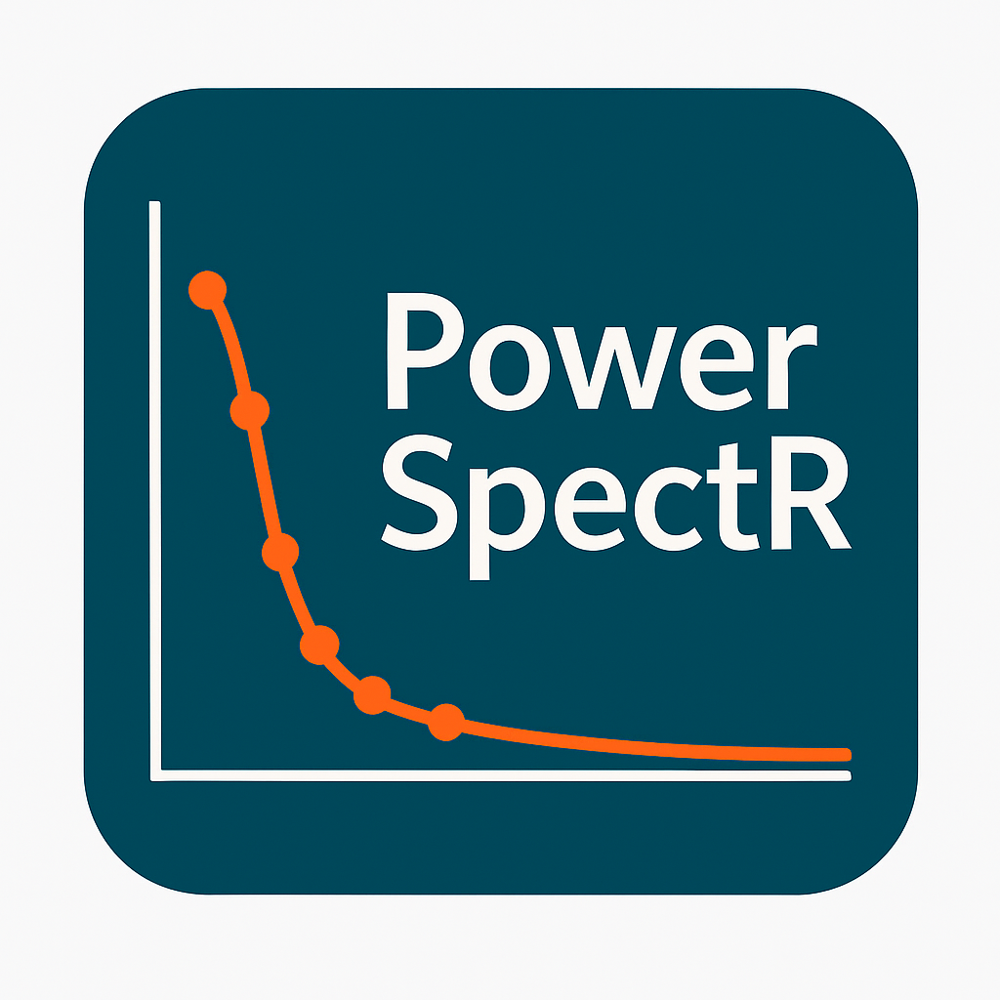
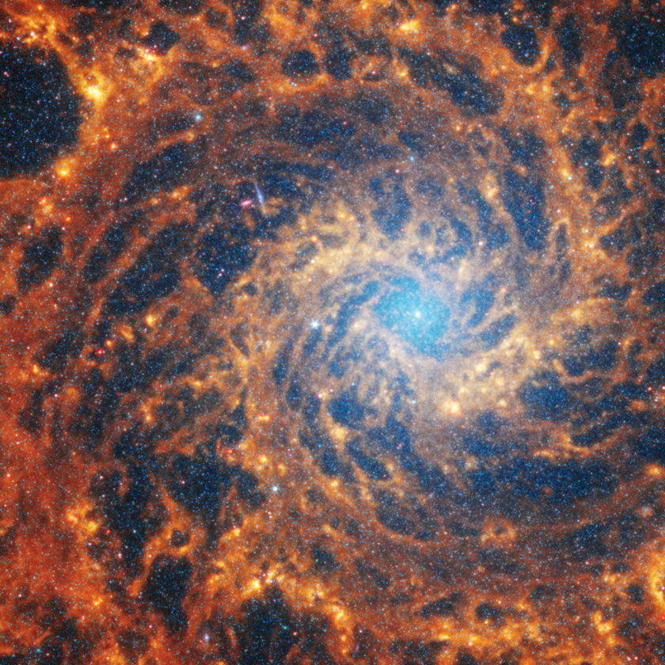
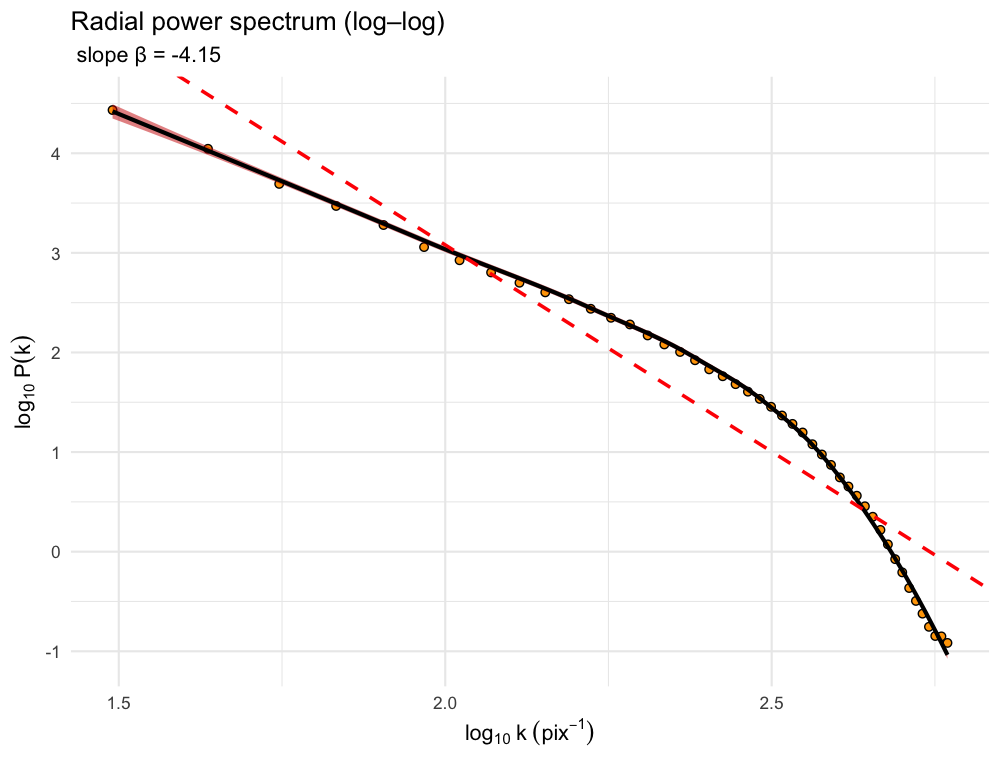
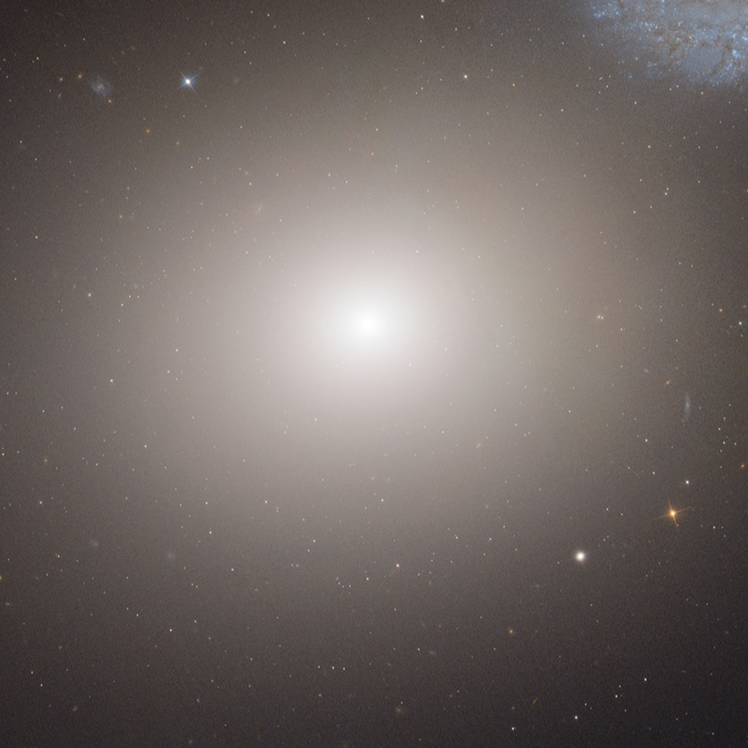
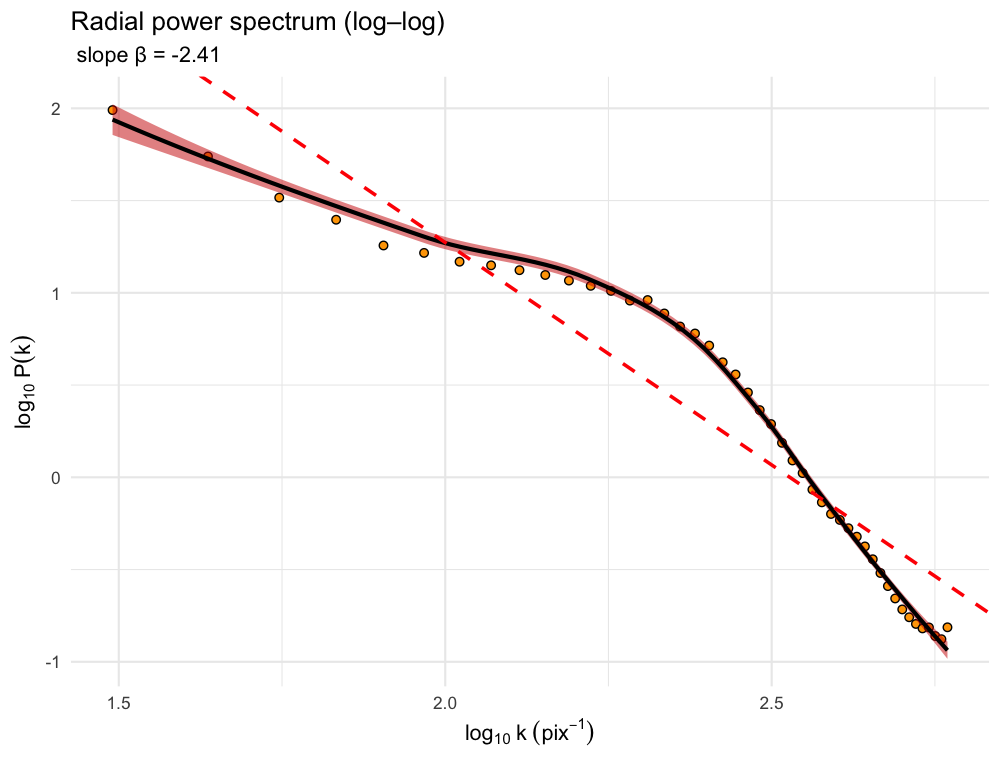

```{=html}
<div class="hero-brand">
  <div class="hero-brand-copy">
    <div class="hero-kicker">R package by Rafael S. de Souza</div>
    <div class="hero-title">PowerSpectR: An R Package for Radial Power Spectrum Estimation</div>
    <div class="hero-copy">Median-based Fourier power-spectrum analysis for 2-D images in astronomy and beyond.</div>
    <div class="hero-actions">
      <a class="hero-button hero-button-primary" href="#installation">Install</a>
      <a class="hero-button" href="#quick-start">Quick Start</a>
      <a class="hero-button" href="https://github.com/RafaelSdeSouza/PowerSpectR">GitHub</a>
    </div>
  </div>
  <div class="hero-brand-logos">
    
    <div class="hero-affiliation">
      <span> Applications to astronomy, remote sensing, and texture analysis.</span>
    </div>
  </div>
</div>
```

## General features

**PowerSpectR** turns a 2-D image into a robust 1-D radial power spectrum:

- read an image and convert it to grayscale
- apply an optional taper to reduce FFT edge artifacts
- shift the Fourier power image to the centered frequency frame
- summarize concentric annuli with the median, not the mean
- fit a power-law slope on log-log axes
- visualize the result with a publication-ready plot

## Medianized Spectra

The median radial profile is often more stable than a plain azimuthal mean when
an image contains compact bright sources, masking scars, or a few localized
structures that would otherwise dominate the spectrum.

::: {.grid}
::: {.g-col-12 .g-col-md-4}
### Robust to outliers

Median annuli reduce the influence of bright point-like features and isolated
 artifacts in Fourier space.
:::

::: {.g-col-12 .g-col-md-4}
### Minimal workflow

The package exposes a short, readable function chain that stays close to the
 underlying spectral method.
:::

::: {.g-col-12 .g-col-md-4}
### How to plot

You can compute the spectrum and render the fitted slope in just a few lines of
 R.
:::
:::

## Quick Start

```r
library(PowerSpectR)

img_path <- system.file(
  "extdata",
  "example_spiral.png",
  package = "PowerSpectR"
)

res <- global_psd(
  img_path,
  nbins = 48,
  drop_bins = 2,
  window = "hann"
)

plot_power_spectrum(res)
```

## Installation

Install from GitHub:

```r
install.packages("remotes")
remotes::install_github("RafaelSdeSouza/PowerSpectR")
library(PowerSpectR)
```

## Spiral vs Elliptical

This comparison uses one obvious spiral and one obvious elliptical galaxy to
show how the radial power spectra can differ for very different morphologies.

::: {.comparison-grid}
::: {.comparison-card}
### NGC 628

::: {.comparison-row}
{.comparison-source}

{.comparison-plot}
:::

Steeper fitted slope: `beta ≈ -4.15`.
:::

::: {.comparison-card}
### M60

::: {.comparison-row}
{.comparison-source}

{.comparison-plot}
:::

Flatter fitted slope: `beta ≈ -2.41`.
:::
:::

These values are illustrative rather than physically calibrated, since they
depend on the bandpass, image processing, crop, and fitting choices.

Spiral image credit: NASA, ESA, CSA, STScI, PHANGS Team, Janice Lee (STScI), Thomas Williams (Oxford).  
Spiral source: [Webb and Hubble's Views of Spiral Galaxy NGC 628](https://science.nasa.gov/asset/webb/webb-and-hubbles-views-of-spiral-galaxy-ngc-628/)

Elliptical image credit: NASA, ESA, and the Hubble Heritage Team (STScI/AURA)-ESA/Hubble Collaboration.  
Elliptical source: [Elliptical Galaxy M60](https://science.nasa.gov/asset/hubble/elliptical-galaxy-m60/)

## Core Functions

::: {.function-grid}
::: {.function-card}
### `read_gray_matrix()`

Load a grayscale image into a numeric matrix for downstream analysis.
:::

::: {.function-card}
### `hann2d()`

Create a 2-D `"hann"`, `"blackman"`, or `"none"` taper before the FFT.
:::

::: {.function-card}
### `fftshift_matrix()`

Move the zero-frequency component to the center of the Fourier image.
:::

::: {.function-card}
### `radial_stats_median()`

Aggregate the centered power image in radial bins using the median.
:::

::: {.function-card}
### `global_psd()`

Run the full spectrum workflow and estimate the fitted slope.
:::

::: {.function-card}
### `plot_power_spectrum()`

Plot the log-log profile and optionally overlay the image as an inset.
:::
:::

## Applications

PowerSpectR is a good fit when you want a compact spectral summary of spatial
structure in:

- astronomical imaging
- remote-sensing texture analysis
- microscopy or materials imaging
- simulated data products where scale-free structure matters

## References

1. Elson, R. A. W., Fall, S. M., and Freeman, K. C. (1989). *The power spectrum of structure in irregular galaxies.* The Astrophysical Journal, 336, 734-754.
2. Lazarian, A. and Pogosyan, D. (2000). *Velocity modification of turbulence spectra observed in spectral lines.* The Astrophysical Journal, 537(2), 720-748.
3. Starck, J.-L., Murtagh, F., and Fadili, J. (2015). *Sparse Image and Signal Processing.* Cambridge University Press.
